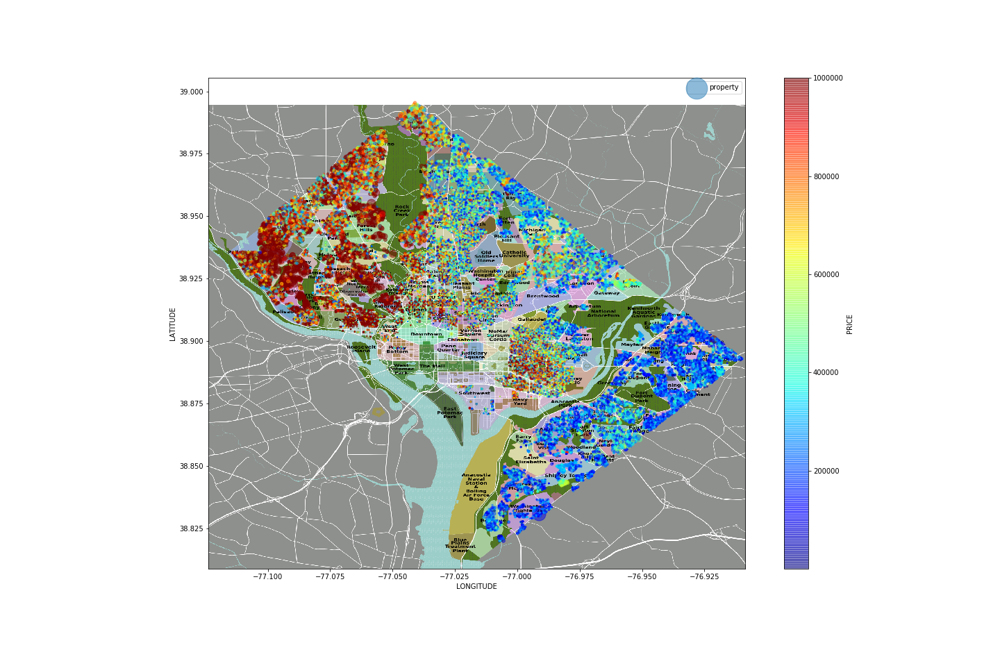

# D.C. Residential Properties Data

**Attribution**: *Hands-On Machine Learning with Scikit-Learn, Keras, and TensorFlow*, 2nd Edition, by Aurelien Geron (O'Reilly). Copyright 2019 Kiwisoft S.A.S, 978-1-492-03264-9 

Machine Learning Practice. Implimenting the project following the Chapter-2 project on O'REILLY's Hands-On Machine Learning.  

**Goal**: Predict house price, given all the other metrics.  
**Approach**:
<ol>
    <li>Supervised Learning task, because given labeled traning examples.</li>
    <li>Regression task, since we need to predict a value.</li>
    <li>Multiple regression problem since the system will use multiple features to make a prediction.</li>
    <li>Univariate regression problem since we are only trying to predict a single value.</li>
    <li>There is no continuous flow of data, no need to adjust to changing data, and the data is small enough to fit in memmory: Batch Learning</li>
</ol>

**Possible Performance Measure:** Root Mean Square Error (RMSE), and Mean Absolute Error (MAE).  
**Data:** [DC Residential Properties | Kaggle](https://www.kaggle.com/christophercorrea/dc-residential-properties) 
**Project Author:** Maksim Ekin Eren

**Attributes Used for Predictions:**

 - Heating unit type
 - AC (yes/no)
 - Number of Rooms
 - Number of Bedrooms
 - AYB: The earliest time the main portion of the building was built
 - EYB: The year an improvement was built more recent than actual year built
 - Number of stories
 - GBA: Gross building area in square feet
 - Building style
 - Structure type
 - Real estate grade
 - Current condition
 - External wall type
 - Roof type
 - Internal wall type
 - Number of kitchens
 - Number of fireplaces
 - Land area
 - Zipcode
 - Latitude
 - Longitude
 - Neighborhood
 - Ward
 - Quadrant
